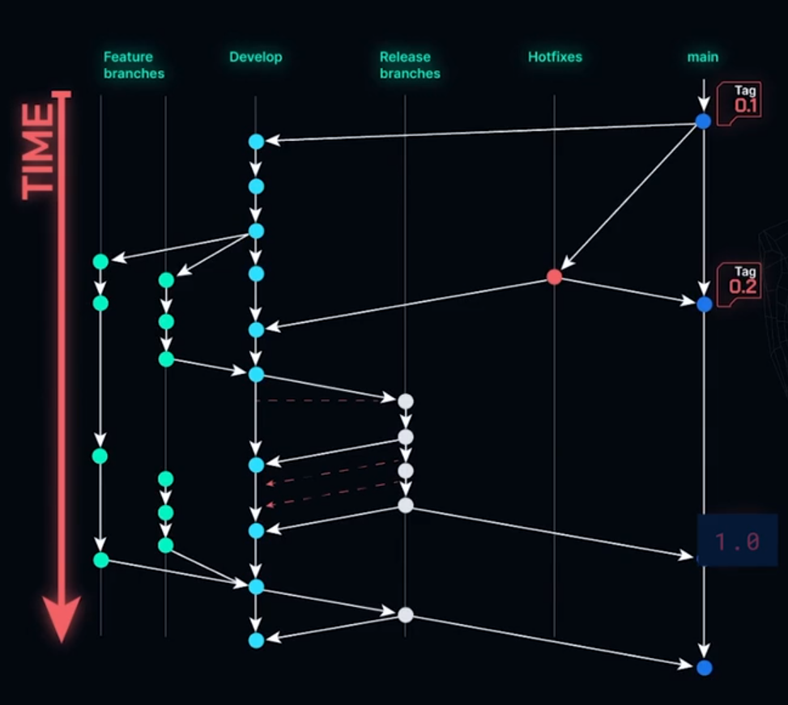

# Trabalhando com Work Flows

## Entendendo o GitFlow

O primeiro deles é o GitFlow, usado em projetos de software mais robustos, com equipes maiores. Nesse modelo de desenvolvimento, temos algumas branches específicas, com duas branches principais que existirão ao longo de todo o ciclo de desenvolvimento do software. No caso do All Books, teremos essa branch enquanto estivermos desenvolvendo a nossa API. Vamos entender um pouco mais sobre elas.

Gráfico de fluxo de versionamento de software utilizando o modelo GitFlow. Na lateral esquerda há uma seta vermelha apontando para baixo com o rótulo "time", ou seja, tempo. Da esquerda para direita há cinco branches, representadas por linhas verticais quase transparentes, são elas: "Feature branches", "Develop", "Release branches", "Hotfixes" e "main". Pontos azuis, verdes e brancos representam commits, com setas indicando a direção do fluxo de desenvolvimento. À direita da branch "main" há tags de versões, mostrando pontos de lançamento no branch principal.

A primeira delas é a branch ""main"", que traz todo o código estável, pronto para ser produzido e usado pelas pessoas usuárias. A segunda branch que temos é a branch "Develop" (Desenvolvimento), que contém todo o código-base para o nosso desenvolvimento e para a criação de outras branches.

Supondo que no All Books queremos implementar uma nova feature (funcionalidade): adicionar uma imagem na hora de fazer uma avaliação de um livro. Para isso, criaremos um novo tipo de branch, que é uma branch de feature. Essa branch de feature será criada a partir da branch "Develop" e, nela, criaremos nossos commits para desenvolver essa funcionalidade.

Por exemplo, criaremos um commit que permite fazer um upload da imagem, salvando essa imagem no banco, e outro commit para fazer a requisição na API que trará essa imagem de volta quando necessário. Faremos todo o passo a passo para a implementação dessa funcionalidade.

Podemos ter várias branches de feature existindo em paralelo ao longo do desenvolvimento. Então, temos a funcionalidade que estamos trabalhando, como a de inclusão de imagens, e podemos ter outra pessoa da equipe trabalhando em outra funcionalidade, como reportar algum abuso ou adicionar uma avaliação negativa. Elas serão desenvolvidas em paralelo ao longo do tempo.

Finalizado o desenvolvimento da funcionalidade, vamos passar esse código da branch de feature para ser novamente integrado à "Develop". Após desenvolver uma série de funcionalidades, queremos entregar essas funcionalidades para as pessoas usuárias. A partir disso, criamos um novo tipo de branch, que são as branches de release (liberação).

As branches de release vão realizar testes mais robustos e verificar se, de fato, o nosso código está pronto para ser entregue para as pessoas usuárias. Caso encontremos alguns problemas durante essa avaliação do código na release, esse código volta para a "Develop", onde corrigimos esses problemas e depois levamos de volta para a branch de release.

Assim que está tudo pronto na release, teremos uma nova versão do nosso software. Pegamos esse código que está na branch de release e integramos ele na "main", para que a pessoa usuária possa usufruir dessas novas funcionalidades.

A partir daí, temos na "main" toda a questão do versionamento, que no GitHub é feito por tags. Podemos marcar as versões do software como, por exemplo, 0.1, 1.0 e assim sucessivamente. Não vou entrar em detalhes em relação a essa questão de tags, mas teremos uma atividade nesse curso que trará mais detalhes disso para você.

Caso nossas pessoas usuárias encontrem algum bug crítico em produção, como, por exemplo, não conseguirem usar o All Books e ocorreu um erro de segurança, não conseguimos mais acessar o banco de dados e precisamos corrigir isso rapidamente. Então, criamos um novo tipo de branch, que é uma branch de hotfix, resolvemos esse erro e depois integramos esse código na "main" e na "Develop".

É importante ressaltar que as branches de hotfix são somente para esses erros que impedem a pessoa usuária de usufruir do nosso software. Então, se temos um bug de um botão torto, algo que não impede o uso do software, não criamos essa branch de hotfix.

Portanto, esses três tipos de branch, feature, release e hotfix, são branches de curta duração, que existem somente enquanto resolvemos a questão determinada para elas. E, observando o modelo do GitFlow, temos uma seta vermelha na lateral esquerda escrito "Time", representando o tempo que está correndo enquanto desenvolvemos o nosso projeto.

## Conhecendo o modelo Trunk Based

Outro modelo de desenvolvimento muito comum é o Trunk Based. Nele, a premissa é que teremos uma branch para todo o desenvolvimento do projeto. Todas as pessoas envolvidas vão colocar código direto na branch principal, ou seja, na "main". Eventualmente, podem ser criadas branches de curta duração.

Caso, no All Books, queiramos adicionar uma funcionalidade e julguemos necessário a criação de uma nova branch, podemos fazer isso, mas o comum é que todo o código seja escrito e colocado direto na "main". Para isso funcionar e garantirmos que essa adição de código novo não vai quebrar o código que já existe na "main", precisamos ter uma suite robusta de testes. Isso porque na "main" precisamos de um código estável e pronto para ser entregue à pessoa usuária.

Portanto, toda vez que houver essa integração, nossa suite de testes irá testar nosso código para garantirmos que nada ruim vai acontecer: sem bugs que possam quebrar nada que funciona. Normalmente, esse modelo de desenvolvimento é usado para projetos ou times menores.

Nesse tipo de desenvolvimento, o Trunk Based, aplicamos algumas práticas de DevOps, como a integração contínua e o deploy contínuo.